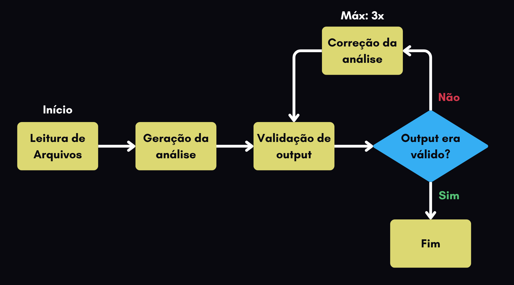
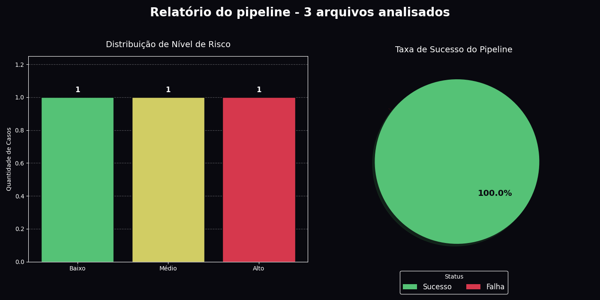
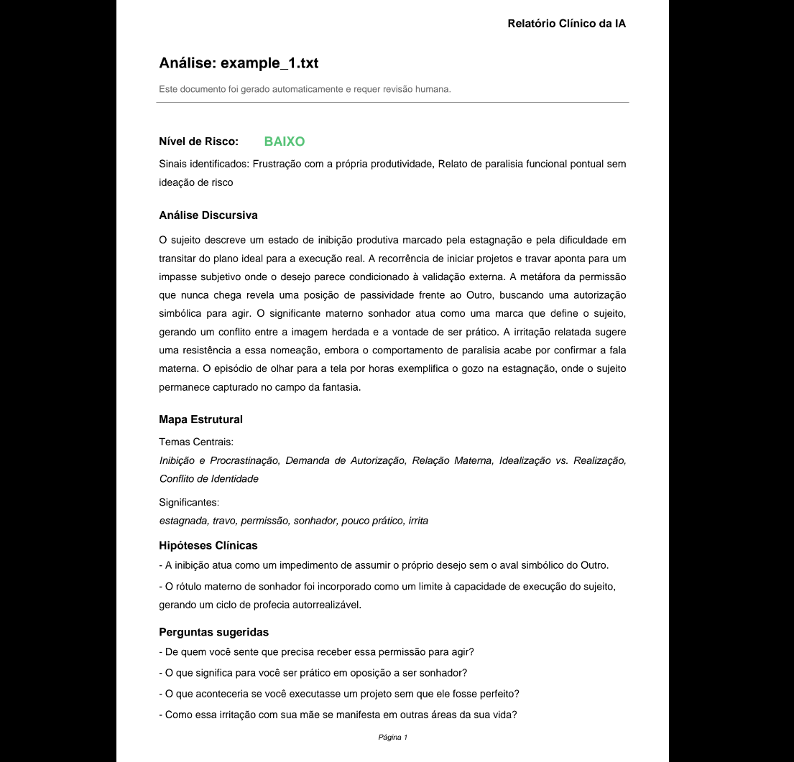

# Lacan 2

Este repositório contém a minha solução para o desafio técnico proposto pela FluxLab AI. O esqueleto inicial do código é portanto de autoria deles.

## Como rodar o projeto

Primeiro, é necessário instalar o [Conda](https://docs.conda.io/projects/conda/en/latest/user-guide/install/index.html) (Miniconda ou Anaconda), e então inicializar o ambiente virtual do Python e instalar todas as dependências com os seguintes comandos:

``` sh
conda env create -f environment.yml

conda activate case_psicanalise
```

Depois, é necessário adquirir uma chave da API do Gemini (pode ser feito [neste site](https://aistudio.google.com/)) e colocá-la em um arquivo `.env`, no diretório raiz. O arquivo deve ficar assim:

``` sh
GOOGLE_API_KEY=Chave_de_exemplo_123
```

Com isso, basta executar o arquivo `pipeline.py`

``` sh
python3 pipeline.py
```

## Escolha de prompts

Existem 3 prompts na pasta `prompts/`, o que será utilizado por padrão é o `prompt_v2`. Contudo, é possível escolher o prompt que será usado com flags (`-v1` e `-v0`) passadas por linha de comando na execução do script:

``` sh
# Executa o programa com o prompt_v1
python3 pipeline.py -v1

# Executa o programa com o prompt_v0
python3 pipeline.py -v0
```

O prompt v1 é uma versão mais simples e aberta do prompt v2, dando mais liberdade para a IA decidir como responder ao input. Isto, contudo, geralmente resulta em análises psicológicas mais caricatas do texto passado a ela, possivelmente por um viés forte de alinhamento com a persona do "psicanalista".

O prompt v0 por sua vez é um experimento para testar a força da opção de output estruturado da API do Google, e se consiste em uma simples frase:

> Faça uma análise psicanalítica do texto/relato deste indivíduo: {INPUT}

Mesmo sem instruções adicionais sobre a formatação e as regras de negócio, o sistema se mostrou capaz de gerar outputs que se adequam ao schema do Pydantic.

## Como funciona o pipeline

A pipeline foi feita com a API de grafos do [LangGraph](https://docs.langchain.com/oss/python/langgraph/graph-api). O primeiro passo é a leitura dos arquivos contendo os inputs do usuário/paciente, que devem ser um arquivo `.txt` no diretório `data/input`. Depois, passamos este input para um "nó de geração", que utiliza uma chamada à API do Gemini para gerar o JSON com a análise clínica inicial. Então, passamos o JSON gerado para o "nó de validação", que irá conferir se a formatação e as regras de negócio estão sendo seguidas através do Pydantic. Por fim, faz-se uma checagem dos erros de validação:

- Se houve erros, vamos para o "nó de correção", que faz uma nova chamada à API do Gemini com um prompt que pede para o agente corrigir os equívocos. O output dessa correção é então enviado novamente para o nó de validação. Este ciclo pode ocorrer no máximo 3 vezes, para evitarmos loops infinitos.
- Se não houve erros, terminamos a pipeline e salvamos o output.

O diagrama da pipeline tem essa forma:



Após a pipeline ser executada para todos os arquivos de entrada, salvamos os resultados em um arquivo chamado `results.json`, juntamente com dashboard simples dos resultados da pipeline em um arquivo chamado `results_dashboard.png`:



## Como interpretar os resultados

Ao final de cada execução do programa, o sistema gera:

1. Arquivo JSON Consolidado (`results.json`): Este arquivo pode ser integrado com outros sistemas ou pipelines para possíveis análises de dado ou linguagem.
2. Dashboard de resultados (`results_dashboard.png`): Contém estatísticas básicas da execução do programa em formato de gráficos, que podem ser interpretadas pelo usuário para saber o grau de risco que os inputs apresentam e a taxa de sucesso do sistema em gerar análises válidas.
3. Para facilitar a leitura do output por humanos (JSON não é um formato ideal para isso), adicionei a funcionalidade de criação de relatórios completos em PDF utilizando [fpdf2](https://pypi.org/project/fpdf2/). Um PDF único com o relatório da IA é gerado para cada arquivo de input, e eles são então armazenados na pasta `data/output/`. Um exemplo de relatório pode ser visto abaixo:



Os relatórios automáticos idealmente deveriam ser interpretados por um profissional, para que ele possa avaliar a validade das hipóteses geradas.

## Modo interativo

Como um bônus, implementei um modo interativo para o sistema, que pode ser executado utilizando a flag `-i`

``` sh
python3 pipeline.py -i
```

Isto iniciará uma rota de execução alternativa, que se assemelha mais a um chat-bot do que ao sistema em "batch" que temos por padrão. Aqui estão as diferenças no comportamento de cada modo:

- Sistema em batch (sem a flag `-i`): todos os inputs na pasta `data/input/` são analisados e, ao fim da execução, seus resultados são armazenados nos arquivos descritos acima.
- Sistema interativo (com a flag `-i`): no terminal, o sistema irá te pedir para digitar o input. Quando o texto for enviado, será encaminhado para a pipeline normalmente. O output então será exibido para o usuário no próprio terminal, formatado para a leitura humana. Por fim, o sistema pedirá um novo input, reiniciando o loop interativo. Para fechar o programa, basta digitar "exit" ou "sair".
